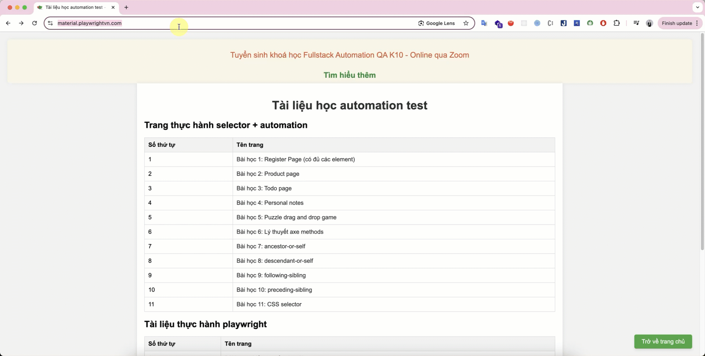

# Javascript
## Đề bài:
Chỉ số BMI (Body Mass Index) là một chỉ số được sử dụng để đánh giá mức độ béo hay gầy của một người, từ đó xác định tình trạng sức khỏe của cơ thể dựa trên chiều cao và cân nặng. Công thức tính BMI như sau:

```
BMI = cân nặng (kg) / (chiều cao (m) * chiều cao (m))
```

### Yêu cầu:
- Viết một hàm JavaScript có tên `calculateBMI` để tính chỉ số BMI dựa trên chiều cao (đơn vị mét) và cân nặng (đơn vị kg) của người dùng.
- Sau khi tính toán, in ra kết quả với các phân loại theo chuẩn sau:
  - BMI < 18.5: "Gầy"
  - 18.5 <= BMI < 24.9: "Bình thường"
  - 25 <= BMI < 29.9: "Thừa cân"
  - BMI >= 30: "Béo phì"

## Ví dụ:
**Input**: 
- Chiều cao: 1.75 mét
- Cân nặng: 68 kg

**Output**: 
- Kết quả BMI: 22.2
- Phân loại: "Bình thường"

# Playwright
## Đề bài
Viết code automation cho test case sau:
- Đi tới trang: https://material.playwrightvn.com/
- Click vào: Bài học 1: Register Page (có đủ các element)
- Điền vào username, email. Click button register.
- Kiểm tra kết quả có chứa username và email tương ứng

## Demo

